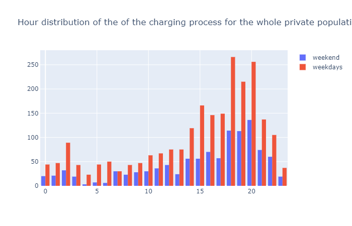
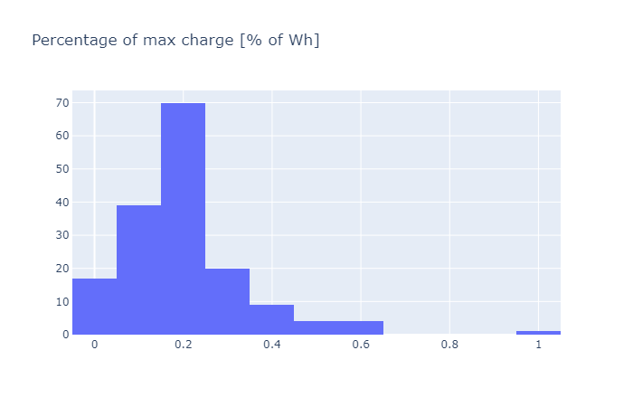
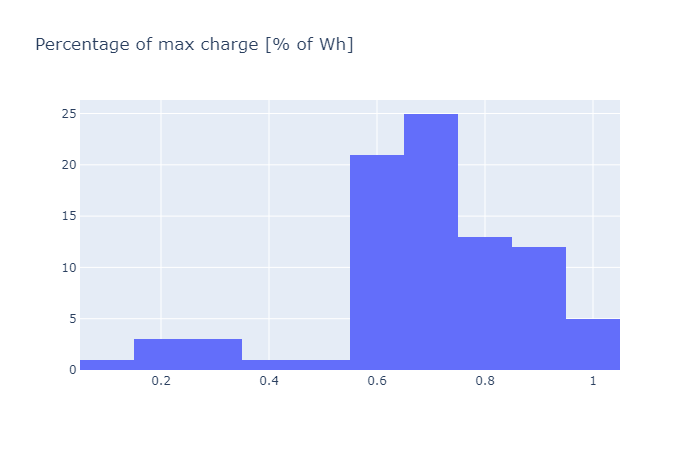
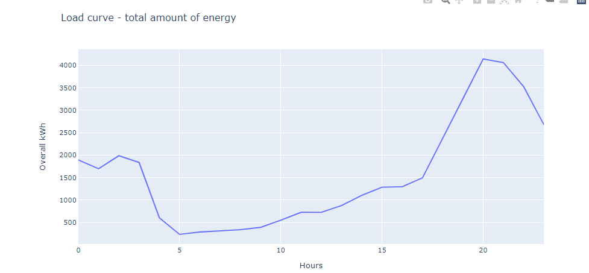
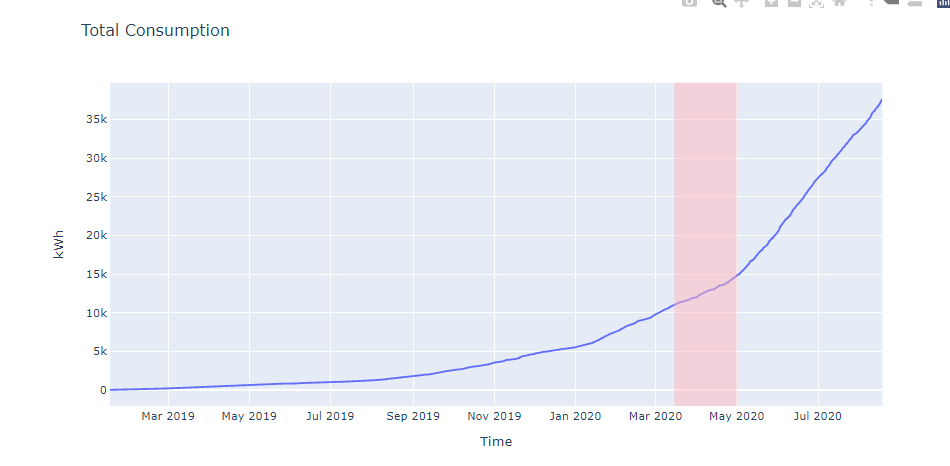

# Energy Hackdays 2020 Group 05 e-mobility behavior analysis

## findings

### public ev charging station

- Typology of municipalities is an important feature for occupied ratio
- highest occupied ratio in big centers and peri-urban rural communes
- low population density: many stations and comparibaly high occupation
- with higher population density we have fewer amount of stations
- minimum occupied ratio on 50 pers/ha population density
- high occupation on high population density

### private ev charging station
Different charging patterns of private customers:
- Charging needs
- Hours of charging
- Week days of charging

This provide good hints for a further automated customer segmentation.

### comparison of privat & public charging behavior
- different time-profile on weekdays and weekend in public, but not in private

## possible next steps

### public ev charging station
- occupation forecast for every charging station (hourly based day profile integrated on the website ich-tanke-strom.ch ) --> for the customers
- clustering with more location-based data (socio-economic, roads, traffic etc.) --> understanding of different charging patterns
- compare clusters of charging behavior with pv potential and production profiles --> own consumption of charging stations

### private ev charging station
- automated customer segmentation based on linked information (building data, socio-economoic data, location) --> for the provider
- cost estimation tool for customer --> for the customer
- prediction of behavior changes for the load-curve --> for the grid

## faced challenges
- parsing and structuring provided raw data --> long running tasks
- handling data errors and missing data

## things to do
- run everything on database server
- productionalize frontend to shoot queries onto database and parse them to json 

        
## Data Engineering

### Architecture Overview

data_engineering_diemo/data_eng_architecture.png

### Data Structure of diemo jsons

- EVSEStatuses
    - OperatorID 
    - Operatorname
    - EVSEStatusRecord
        - EVSEID
        - EVSEStatus
        
### Python and SQL part
For parsing the 48'000 json files in 5 minutes resolution for 6 months we used python scripts.
We had to implement various exceptions because of empty jsons.

First we tried looping everything into csv, which did not perform as fast as we would like.
We then tried Apache Feather as a data transfer format but the data storage speed wasn't the problem.
The next try was a sqlite database which works fine and was an okay solution for the hackathon.
If the project would go live, we would recommend a database server preferably in the cloud, to get the inital data loading done quick.
The dataload still takes over 10 hours and is not very efficient.

### SQL Queries
The first query is about getting an overlook over all the EV-Charging points, the different operators.

## Visualisation ideas  

### public ev charging stations
- snapshot for specific time (occupied, available) on a map
- top 3 utilised stations for each canton on a map
- occupation ratio per station on a map
- time-profile clusters --> which stations have the same time-profile
- time-profile in city centers, countryside and touristic regions
- aggregated occupation over time of a day/week for all stations
- occupation over time of a day/week for a selected station
- typically duration of a charging process on a map

## Analyses

### Charging points utilization

Features analysis:

Legend:

1 | Grosszentren

2 | Nebenzentren der Grosszentren

3 | Gürtel der Grosszentren

4 | Mittelzentren

5 | Gürtel der Mittelzentren

6 | Kleinzentren

7 | Periurbane ländliche Gemeinden

8 | Agrargemeinden

9 | Touristische Gemeinden

Occupied ration distribution:

Weekend VS weekdays behaviour for private customers: hourly consumption:

Example of behaviour differences between two private customers: Distribution of the percentage of the whole battery that is charged.

Load curve for private customers:

Overall energy consumption by private e-cars. This also show the adoption curve. The red zone corresponds to COVID time.

