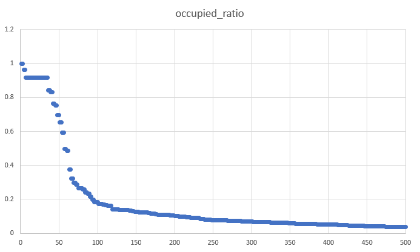

# Energy Hackdays 2020 Group 05 e-mobility behavior analysis

## findings

### public ev charging station

- Typology of municipalities is an important feature for occupied ratio
- highest occupied ratio in big centers and peri-urban rural communes
- low population density: many stations and comparibaly high occupation
- with higher population density we have fewer amount of stations
- minimum occupied ratio on 50 pers/ha population density
- high occupation on high population density

### private ev charging station
- different charging patterns of private customers 

## faced challenges
- parsing and structuring provided raw data --> long running tasks
- handling data errors
...

        
## Data Engineering

### Architecture Overview

### Data Structure of diemo jsons

- EVSEStatuses
    - OperatorID 
    - Operatorname
    - EVSEStatusRecord
        - EVSEID
        - EVSEStatus
        
### Python and SQL part
For parsing the 48'000 json files in 5 minutes resolution for 6 months we used python scripts.
We had to implement various exceptions because of empty jsons.

First we tried looping everything into csv, which did not perform as fast as we would like.
We then tried Apache Feather as a data transfer format but the data storage speed wasn't the problem.
The next try was a sqlite database which works fine and was an okay solution for the hackathon.
If the project would go live, we would recommend a database server preferably in the cloud, to get the inital data loading done quick.
The dataload still takes over 10 hours and is not very efficient.

### SQL Queries
The first query is about getting an overlook over all the EV-Charging points, the different operators.
We additionally provided some other queries which helped us explore the data.
## Further ideas  
### Visualitzation
#### public ev charging stations
- snapshot for specific time (occupied, available) on a map
- top 3 utilised stations for each canton on a map
- occupation ratio per station on a map
- time-profile clusters --> which stations have the same time-profile
- time-profile in city centers, countryside and touristic regions
- aggregated occupation over time of a day/week for all stations
- occupation over time of a day/week for a selected station
- typically duration of a charging process on a map

#### Data Engineering
- run everything on database server
- productionalize frontend to shoot queries onto database and parse them to json
- deploy frontend onto docker image and host in cloud 

## Analyses

### Charging points utilization

Features analysis:

Legend:

1 | Grosszentren

2 | Nebenzentren der Grosszentren

3 | Gürtel der Grosszentren

4 | Mittelzentren

5 | Gürtel der Mittelzentren

6 | Kleinzentren

7 | Periurbane ländliche Gemeinden

8 | Agrargemeinden

9 | Touristische Gemeinden

Occupied ration distribution:

